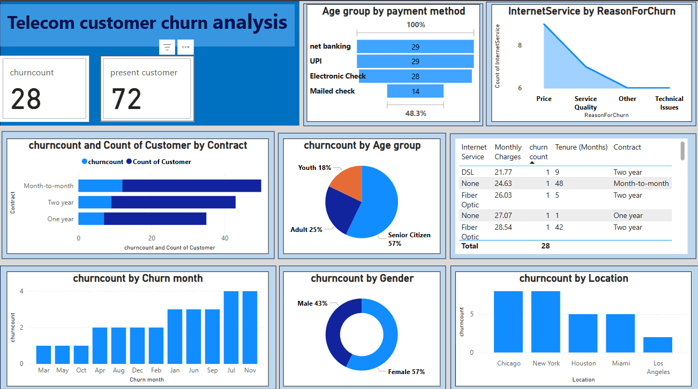

# Telecom-Churn-analysis-
Business Problem: Customer Churn Analysis for a Telecom Company
Problem Statement: A telecom company is experiencing a decline in its subscriber base and wants to analyze customer churn to identify key reasons for customer attrition. Your task is to analyze the data, generate insights using SQL, Power BI, and Excel, and provide recommendations to reduce churn.

### Project Objective
Analyze customer churn to identify key factors contributing to attrition and provide actionable recommendations to reduce churn, improve customer retention, and enhance business performance.

### Project Description
The telecom company is experiencing a decline in its subscriber base due to customer churn. This project aims to analyze the data using Power BI, and Excel to uncover patterns and insights related to customer churn. We will identify key factors contributing to churn, segment customers based on their behavior, predict potential churners, and visualize trends using dashboards. These insights will aid in making data-driven decisions to mitigate churn and enhance customer retention strategies.

### Approach to Solve the Business Problem

1. **Data Collection and Preparation:**
   - Collect data from various sources (e.g., customer demographics, service usage, billing information, customer complaints).
   - Clean and preprocess the data to handle missing values, inconsistencies, and outliers.
  

2. **Excel Analysis:**

--Import the data into Excel and create pivot tables to summarize key metrics.
--Calculate metrics such as churn rate, average monthly charges, and average tenure.
--Use Excel functions and formulas to identify correlations between customer attributes (e.g., contract type, payment method) and churn.

3. **Data Segmentation:**
   - Segment customers based on their behavior and characteristics (e.g., tenure, service usage, payment method).
   - Use clustering techniques to group customers with similar attributes.
   - Analyze segments to identify high-risk groups for potential churn.

4. **Data Visualization with Power BI:**
   - Create interactive dashboards to visualize key insights and trends.
   - Include visualizations such as churn rate over time, churn by contract type, and churn by monthly charges.
   - Highlight key segments and high-risk customers for targeted interventions.

5. **Recommendations and Action Plan:**
   - Provide actionable recommendations based on the analysis.
   - Suggest strategies to reduce churn, such as personalized offers, improved customer service, and targeted retention campaigns.
   - Outline an action plan for implementation and monitoring of the recommendations.

### Key Insights and Suggestions

1. **Contract Type:** Month-to-month contracts are associated with higher churn rates compared to long-term contracts. Consider offering incentives for customers to switch to longer-term contracts.
2. **Monthly Charges:** Higher monthly charges correlate with increased churn. Evaluate pricing strategies and consider offering discounts or bundling services to reduce the cost burden on customers.
3. **Customer Tenure:** Customers with shorter tenure are more likely to churn. Focus on engaging new customers through onboarding programs and personalized communication.
4. **Payment Method:** Certain payment methods (e.g., electronic checks) are linked to higher churn. Explore alternative payment options and promote the use of convenient methods such as auto-pay.
5. **Service Issues:** Address common reasons for churn such as service quality and technical issues. Implement proactive measures to improve service reliability and customer satisfaction.

Implementing these strategies will help the telecom company reduce churn, improve customer retention, and ultimately enhance business performance.

